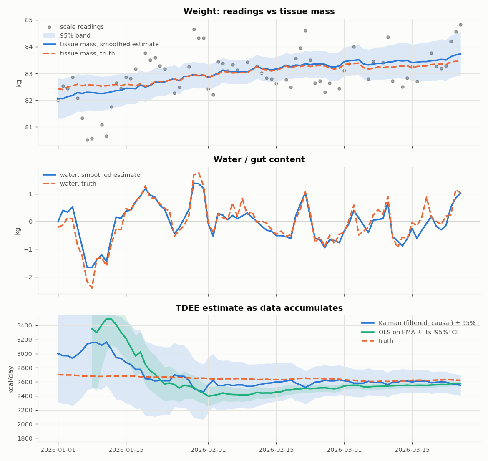
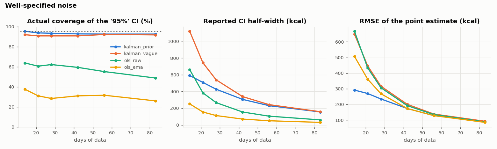

# Kalorie

**Kal**man filter + ca**lorie**. A nutrition and training tracker I use every day to hit my goals (currently a lean bulk: slow weight gain,
protein target, progressive overload), and the statistics behind its most important number: **how many
calories I actually burn**, estimated from a bathroom scale and a food log, with confidence intervals that
mean what they say.

The project started as a practical tool. Using it daily raised statistical questions I could not answer with
the first version: why did the "measured" expenditure jump by 300 kcal from one week to the next, and how much
should I trust it? Answering them properly is what the `src/` library and the notebooks are about.



## The app

`app/` is a local web app (NiceGUI, UI in French) built around one question: *am I on track, and what
should I eat?*

- **Log**: meals (generic food database + OpenFoodFacts search), morning weigh-ins, waist measurement, steps,
  climbing / running / calisthenics sessions with sets, reps and added load.
- **Today**: calories and macros left for the day, 7-day average vs target (consistency matters more than any
  single day), weight without water, rate of gain with its confidence interval, best recent sets vs record.
- **Weekly check-in**: the calorie target is recomputed once a week from the estimated expenditure and the
  target rate (e.g. +0.5 kg/month), capped at ±150 kcal per week, and frozen until the next check-in, so the
  target does not chase daily scale noise.
- **Trends**: weight with the filtered tissue-mass curve, target vs actual trajectory, intake regularity,
  macros, training volume and strength progression.

```bash
python app/main.py        # generates 70 days of demo data on first launch → http://localhost:8080
TRACKER_DATA=/path/to/my/data python app/main.py   # your own data
```

## The statistical problem

Expenditure follows from energy balance: TDEE = mean intake − (change in body mass × 7700) / days. Intake is
logged; the hard part is the change in body mass, because the scale measures something else:

**scale reading = tissue + water + noise**

Water (salt, carbs, digestion, travel) moves by ±1 kg and **persists for several days**. The usual approach
(mine included, at first) regresses weight on time and backs out TDEE = mean intake − slope × 7700. Its
textbook confidence interval assumes independent residuals. With water persistence φ ≈ 0.77, the long-run
variance of the residuals is roughly 7 times what the i.i.d. formula assumes, so the true standard error is
about 2.7 times larger and a nominal 95% interval covers about 53% of the time. Smoothing the weight first
(an EMA, as many apps do) is worse: residuals shrink and become even more correlated.

## The model

Daily state `x = [W, T, H]`, estimated with a Kalman filter (causal) and a Rauch-Tung-Striebel smoother:

| state | meaning | dynamics |
|---|---|---|
| `W` | tissue mass (kg) | `W' = W + (I − T) / 7700`: moves only with the energy balance |
| `T` | TDEE (kcal/day) | slow random walk |
| `H` | water / gut content (kg) | AR(1), mean-reverting |

Observation: `y = W + H + v`. `I` is the *logged* intake, so `T` is expressed in "logging units": a systematic
logging bias is absorbed into `T`, which is what you want when the output is a target compared against logged
intake. `T` is never observed directly; it is inferred through the negative covariance between `W` and `T`
(if expenditure were higher, less would have been stored and the scale would read lower).

- Missing weigh-ins and unlogged days are handled natively (prediction step only).
- Innovations beyond 2.5 sd are down-weighted (travel water spikes).
- `regime_breaks` re-inflates TDEE uncertainty at a known lifestyle change.
- Noise parameters (`phi`, `sigma_h`, `sigma_v`) were fitted by maximum likelihood on ~3 months of my own
  weigh-ins (`tdee.calibrate`). The data itself is not in this repository.

## Results on synthetic users

500 simulated users with a known TDEE, including water spikes and missing days the filter does not model
(`notebooks/02_ci_coverage.ipynb`). How often the true TDEE falls inside the reported 95% interval:

| days of data | Kalman (prior off by ±300) | Kalman (uninformative prior) | OLS, i.i.d. SE | OLS, Newey-West SE | OLS on EMA |
|---|---|---|---|---|---|
| 14 | 95% | 92% | 64% | 57% | 38% |
| 28 | 93% | 91% | 62% | 68% | 28% |
| 56 | 93% | 92% | 55% | 68% | 32% |
| 83 | 93% | 92% | 49% | 66% | 26% |



**Why not just Newey-West?** HAC standard errors are the standard fix for autocorrelated residuals, and they
barely help here. With 10 to 65 readings and strong persistence, the long-run variance estimator is biased
downward: the sample is too short to see the correlation it is supposed to correct. Correcting the standard
errors is not enough on short, persistent series; the dependence has to be modelled.

What the table does **not** show: with an uninformative prior, the Kalman *point* estimate is about as accurate
as OLS after a few weeks (RMSE ~90 kcal at 12 weeks for every method). The gain is honest uncertainty, plus
better early estimates when a reasonable prior exists.

Robustness checks in the same notebook:
- **Misspecified noise** (water noisier and more persistent than assumed): Kalman coverage drops to 77–92%,
  against 51–65% for Newey-West and 26–32% for OLS on EMA.
- **Unannounced TDEE step (+300 kcal)**: with a slow random walk the filter lags, and coverage falls to ~35–42%
  after the step. Declaring the change (`regime_breaks`) restores ~91%.
- **Calibration** (`notebooks/03_noise_calibration.ipynb`): `phi` and `sigma_h` are recovered well from 120
  days; `sigma_v` is poorly identified, and `sigma_t` (TDEE drift) tends to collapse to 0 (the usual pile-up of
  variance MLEs at the boundary on short series), so its default is a modelling choice rather than a fit.

## Limitations

- 7700 kcal/kg in both directions; the energy density of gained vs lost tissue actually differs.
- Gaussian model with a crude robust gate; heavy-tailed water events are handled approximately.
- Intervals cover estimation noise, not a systematic logging bias (absorbed into `T` by design).

## Project structure

- `app/`: the tracker (`core/` data and energy logic, `ngui/` pages, `make_demo_data.py`)
- `src/tdee/`: library: `model.py` (filter + smoother), `baselines.py` (OLS, Newey-West), `simulate.py`,
  `calibrate.py`
- `notebooks/`: 01 walkthrough on one user, 02 interval coverage, 03 noise calibration
- `tests/`: coverage and sanity tests

## Getting started

```bash
git clone https://github.com/Alexandre-Reyob/kalorie.git
cd kalorie
pip install -r requirements.txt
pytest -q
jupyter notebook notebooks/
python app/main.py
```

## About me

I'm Alexandre Boyer, a student at CentraleSupélec and ESSEC. I built this app to stick to my own nutrition and
training goals, and kept working on it because the statistics turned out to be the interesting part.

## License

MIT
